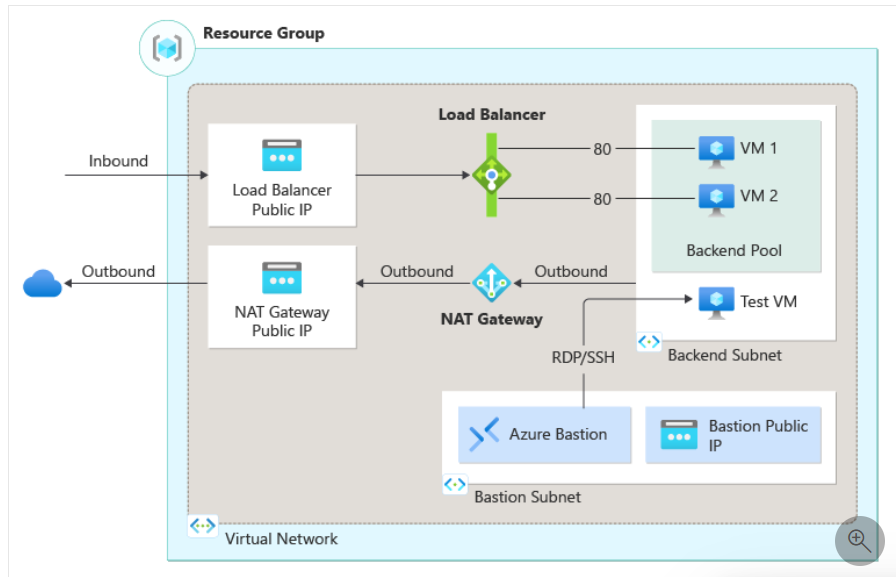

# Create Azure Public Load Balancer using Terraform

**There will be 20 objectives for this lab:**
* Create resource group
* Create Vnet
* Create Backend subnet and Bastion subnet
* Create Load Balancer, Bastion, and NAT Gateway Public IPs (PIP)
* Create network security group (NSG)
* Create network security group rule
* Create network interface cards (NIC)s
* Associate the NICs to the NSG
* Create Load Balancer, health probe, and HTTP Rule
* Create Azure Bastion host
* Create virtual machines (VMs)
* Attach NICs to load balancer backend pool
* Create NAT Gateway
* Associate the NAT PIP with the NAT Gateway resource
* Associate the NAT Gateway with the Backend subnet
* Install the IIS module to handle the public webpage. 
* Verify all connections are working.
* Create YAML for GitHub Actions with proper Azure Credentials
* Create variables.tf, providers.tf, and output.tf files for Terraform resource handling.
* Create service principal to deploy Terraform code to Azure 

All of these objectives are outlined in the Terraform code so you can follow along to see exactly how it was done. 
